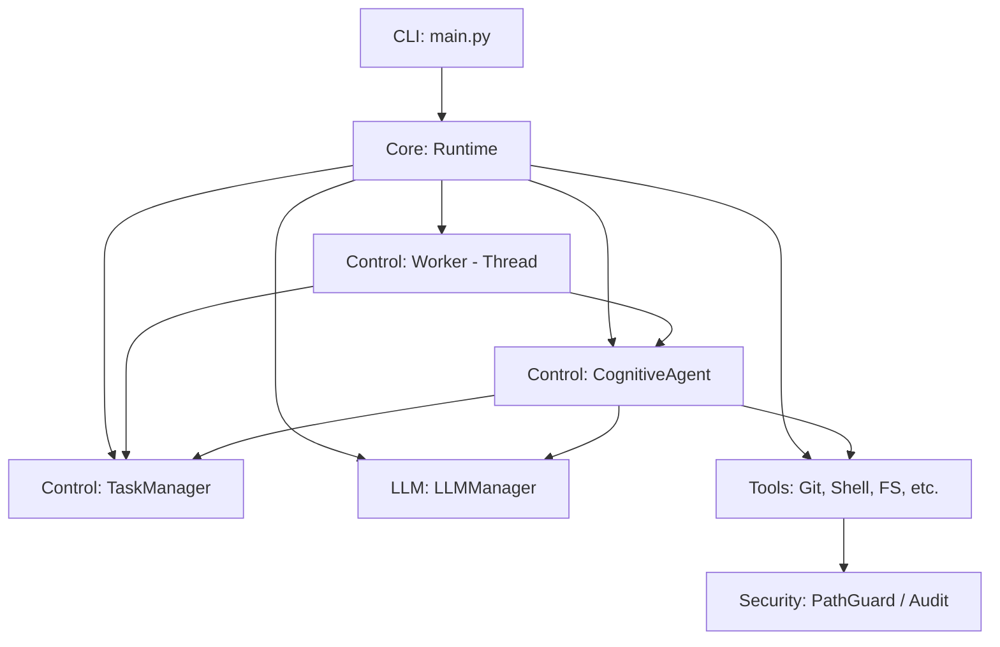
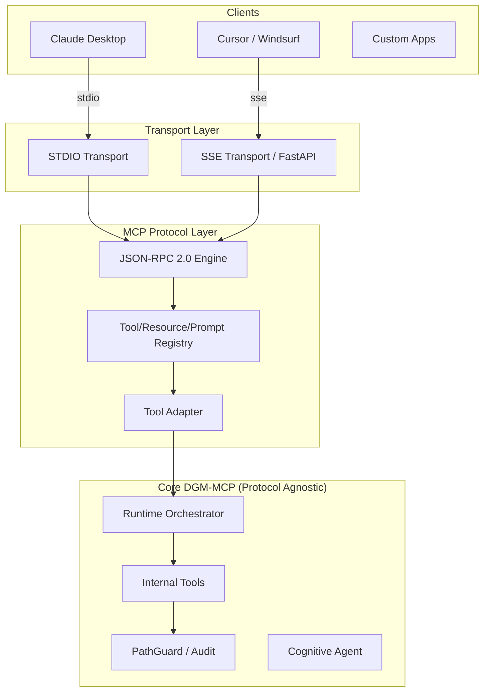

# ARCHITECTURE_MAP.md

## Current Architecture Overview (Transitioning)

## Target Architecture (MCP-Native)

The architecture is designed to support multiple clients via standardized transports, while keeping the core logic isolated.

### Key Architectural Principles:

1.  **Isolation**: The `Core` (Runtime, Tools, Security) has zero knowledge of MCP. It only knows how to execute tasks and enforce security.
2.  **Standardization**: All communication follows the Model Context Protocol v1.0.
3.  **Flexibility**: New tools added to `Core` are automatically exposed via the `Registry` and `Adapter`.
4.  **Transport Independence**: The same protocol logic handles both local (Stdio) and remote (SSE) clients.

## Component Roles in MCP Context:

- **Registry**: The single source of truth for tool schemas. It scans the existing toolset and generates MCP-compatible metadata.
- **Adapter**: Maps the flattened MCP `call_tool` parameters to the specific keyword arguments required by our internal `execute` methods.
- **Runtime**: Continues to be the orchestrator for session state, logging, and security context.

## Migration Status:
- **Core Logic**: 100% Stable.
- **REST Bridge**: Deprecated (replaced by SSE).
- **MCP Layer**: Under implementation (Phase 1-2).
- **Transports**: Pending (Phase 4 & 7).
