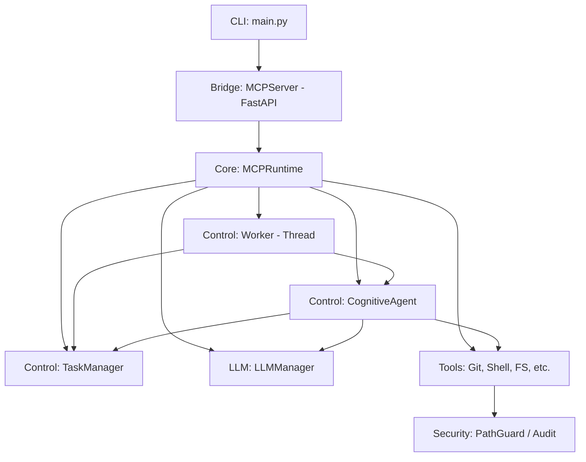
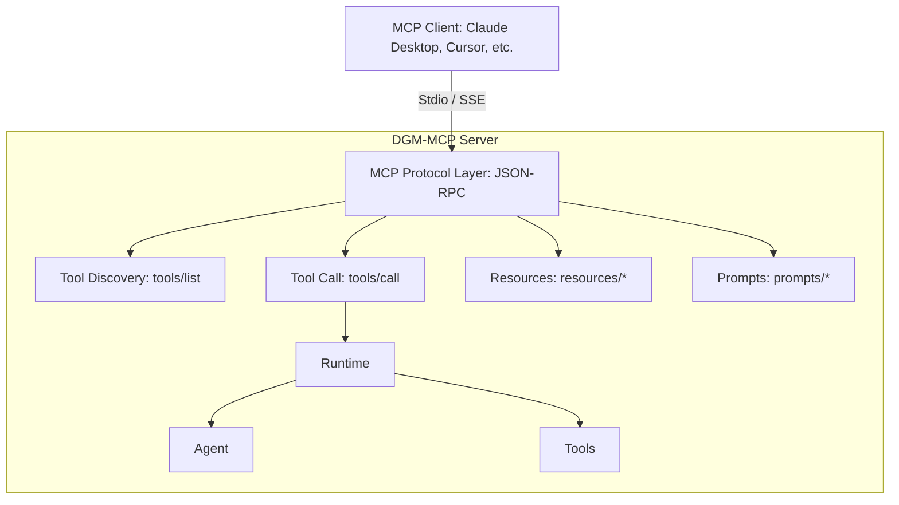

# ARCHITECTURE_MAP.md

## Current Architecture Overview (Custom REST)

### Current Component Roles:
- **CLI**: Entry point for commands (`start`, `test`, `status`).
- **Bridge (MCPServer)**: Custom FastAPI server exposing `/mcp/task`. This is NOT a standard MCP server yet.
- **Runtime**: Central orchestrator initializing all components.
- **CognitiveAgent**: The "brain" that generates plans (JSON) using LLMs and executes them step-by-step.
- **Worker**: A background thread that polls for tasks to analyze or execute.
- **TaskManager**: Simple in-memory store for Tasks.
- **Tools**: Atomic operations following the `BaseTool` interface.

---

## Target Architecture (MCP-Compatible)

The goal is to insert a **Standard MCP Protocol Layer** that can handle various transports and speak JSON-RPC 2.0.

### Key Changes:
1.  **New `mcp` package**: Will house the JSON-RPC engine and message definitions.
2.  **Transport Layer**: Separate logic for Stdio (local) and SSE (web/remote).
3.  **Bridge Refactoring**: The current `MCPServer` (FastAPI) will become one of the transports (SSE) and will use the new Protocol Layer.
4.  **Tool Mapping**: `BaseTool` must expose JSON Schema for MCP discovery.

---

## Dependency Map

| Component | Depends On | Stability | Impact of MCP Transition |
| :--- | :--- | :--- | :--- |
| **CLI** | Bridge, Runtime | High | Minimal (will support `stdio` mode) |
| **Bridge** | Runtime, Agent | Low | Major refactor to use Protocol Layer |
| **Runtime** | Everything | Medium | Moderate (needs to support synchronous tool calls) |
| **CognitiveAgent** | LLM, Tools, TM | High | Low (logic remains similar, but call interface changes) |
| **Tools** | PathGuard, Audit | High | Medium (needs JSON Schema metadata) |
| **Worker** | Runtime, TM | Medium | Low (might become optional for synchronous MCP calls) |

---

## Migration Strategy

### What stays the same:
- **Core Logic**: `PathGuard`, `AuditLogger`, `LLMManager`, and the actual `execute` logic of Tools.
- **Agent Reasoning**: The way `CognitiveAgent` creates plans can remain, though we might expose "Plan Creation" as an MCP Prompt.

### What breaks:
- **REST API**: `/mcp/task` will be deprecated in favor of standard MCP endpoints.
- **Tool Initialization**: Tools will need to be registered with the Protocol Layer using their schemas.

### Compatibility Strategy:
- Maintain the FastAPI server as an **SSE Transport**.
- Keep `/mcp/task` as a legacy/shim endpoint during the transition.
- Use a **Protocol Adapter** to bridge MCP Tool Calls to existing `BaseTool.execute`.

---

## Rollback Strategy
1.  **Version Tagging**: Every phase will be tagged in Git.
2.  **Feature Flags**: Use `config.yaml` to toggle between "Legacy REST" and "MCP Native" modes.
3.  **Parallel Execution**: Run the new Stdio server while keeping the FastAPI server active on a different port.
