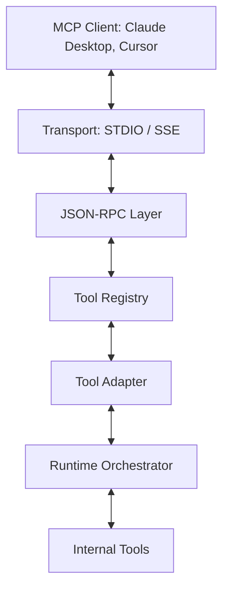

# MCP_PROTOCOL_DESIGN.md

This document defines the architecture and design of the Model Context Protocol (MCP) integration in DGM-MCP.

## 1. Architecture Overview

DGM-MCP follows a layered architecture where the MCP Protocol is an external communication interface that bridges the gap between MCP Clients and the internal DGM-MCP Runtime.

## 2. Component Definitions

### 2.1 JSON-RPC Layer
Responsible for parsing and serializing JSON-RPC 2.0 messages. It handles:
- Request/Response mapping via `id`.
- Standardized error codes.
- Notification handling.

### 2.2 Tool Registry
A central repository for all available tools.
- Maintains a mapping between tool names and their implementations.
- Generates the JSON Schema for the `tools/list` response.
- Provides a lookup mechanism for `tools/call`.

### 2.3 Tool Adapter
Bridges the MCP `tools/call` parameters to the `BaseTool.execute` method.
- Validates input against JSON Schema.
- Converts `ToolResult` back to MCP `CallToolResult`.

### 2.4 Runtime Adapter
Handles the execution context. While the Tool Adapter handles the specific tool call, the Runtime Adapter ensures that the `Runtime` is correctly initialized and that security context (`PathGuard`) is passed down.

### 2.5 Transports
- **STDIO Transport**: Handles `stdin`/`stdout` streams for local processes.
- **SSE Transport**: Implements Server-Sent Events over HTTP for web-based clients.

### 2.6 Resources
Exposes static or dynamic system data as URI-addressable resources.
- Implementation: `resources/list`, `resources/read`.

### 2.7 Prompts
Exposes reusable prompt templates.
- Implementation: `prompts/list`, `prompts/get`.

## 3. Call Flow (Tool Execution)

The following flow illustrates how a `tools/call` request is processed:

1. **Client**: Sends a JSON-RPC request (e.g., `tools/call` for "git").
2. **Transport**: Receives the raw byte stream and passes it to the JSONRPC layer.
3. **JSONRPC**: Parses the message, validates the JSON-RPC format, and routes it to the ToolRegistry.
4. **ToolRegistry**: Finds the tool "git" and its associated metadata.
5. **ToolAdapter**: Takes the arguments, validates them, and prepares the call for the Runtime.
6. **Runtime**: Executes the tool within the secure environment (Audit, PathGuard).
7. **Tool**: Performs the actual work (e.g., `git status`).
8. **Result**: Flows back up through the layers, being transformed into a valid MCP response.

## 4. Separation of Concerns

### Components that MUST NOT know about MCP
To maintain architectural purity and allow for future protocol changes, the following components are strictly protocol-agnostic:
- **Runtime** (`src/dgm_mcp/core/runtime.py`)
- **Tools** (`src/dgm_mcp/tools/*`)
- **Security** (`src/dgm_mcp/security/*`)
- **LLM Manager** (`src/dgm_mcp/llm/*`)

### Components that remain unchanged
- **CognitiveAgent**: The internal planning logic remains untouched.
- **Worker**: The background execution loop remains unchanged.
- **PathGuard**: Security policies are independent of the transport layer.
- **AuditLogger**: Logging remains centralized and agnostic of whether the trigger was a REST call or an MCP call.

## 5. Implementation Constraints
- No MCP-specific logic inside `src/dgm_mcp/tools`.
- All JSON-RPC handling is isolated in `src/dgm_mcp/mcp`.
- The `ToolRegistry` is the ONLY source of truth for tool schemas.
